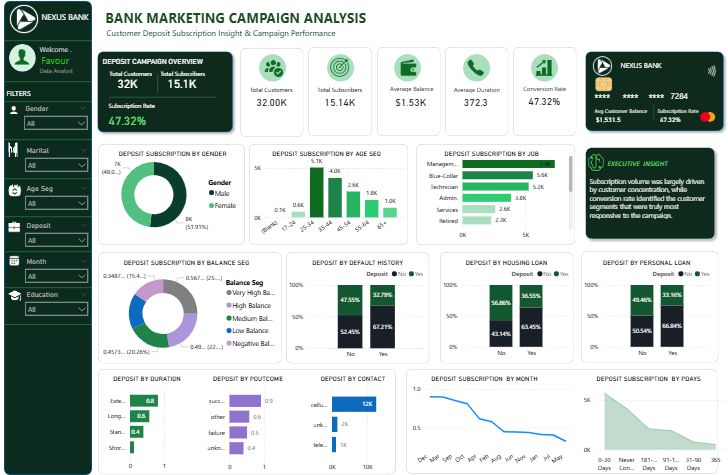

# Bank Marketing Campaign Analysis Dashboard

## Dashboard Preview

## Project Overview

This project analyzes a bank's direct marketing campaign to identify the factors that influence customer subscription to term deposit products. The analysis explores customer demographics, financial characteristics, campaign performance metrics, and historical engagement patterns to uncover opportunities for improving campaign effectiveness and return on investment.

## Business Problem

Banks invest heavily in marketing campaigns to promote term deposit products. However, not all customer segments respond equally.

The objective of this project was to identify:

- Which customer segments are most likely to subscribe
- Factors influencing subscription decisions
- Opportunities to improve campaign targeting
- Strategies for increasing campaign conversion rates

## Tools Used

- Power BI
- Power Query
- DAX
- Microsoft Excel

## Dataset Overview

- Total Customers: 32,000
- Total Subscribers: 15,142
- Subscription Rate: 47.32%
- Average Account Balance: €1,531.54
- Average Call Duration: 372.3 seconds

## Key Findings

### Previous Campaign Success Drives Future Success

Customers who previously responded positively to a campaign achieved a subscription rate of 91.3%, making previous campaign outcome the strongest predictor of conversion.

### Longer Conversations Increase Conversion

Customers with extended call durations achieved an 81.9% subscription rate, compared to only 11.9% for short calls.

### Higher Account Balances Lead to Higher Subscription Rates

Subscription rates increased consistently across balance segments, reaching 56.8% among customers with very high balances.

### Customers Without Housing Loans Convert More Often

Customers without housing loans achieved a subscription rate of 56.9%, compared to 36.6% for customers currently servicing a housing loan.

### Re-engagement Timing Matters

Customers contacted 31–90 days after a previous campaign recorded the highest conversion rate at 83.1%.

## Business Recommendations

- Prioritize customers with successful campaign histories.
- Focus marketing efforts on high-balance customers.
- Improve customer engagement quality rather than call volume alone.
- Optimize campaign scheduling using historical contact timing.
- Prioritize financially stable customers with fewer loan obligations.

## Project Documentation

A detailed business analysis report is included in this repository covering:

- Customer Demographics Analysis
- Loan Status Analysis
- Campaign Performance Analysis
- Subscription Behavior Analysis
- Previous Campaign Outcome Analysis
- Strategic Business Recommendations

## Skills Demonstrated

- Data Cleaning
- Data Transformation
- Data Modeling
- DAX Measures
- Data Visualization
- Business Intelligence Reporting
- Customer Segmentation Analysis
- Marketing Analytics

## Author

Favour Oladapo
